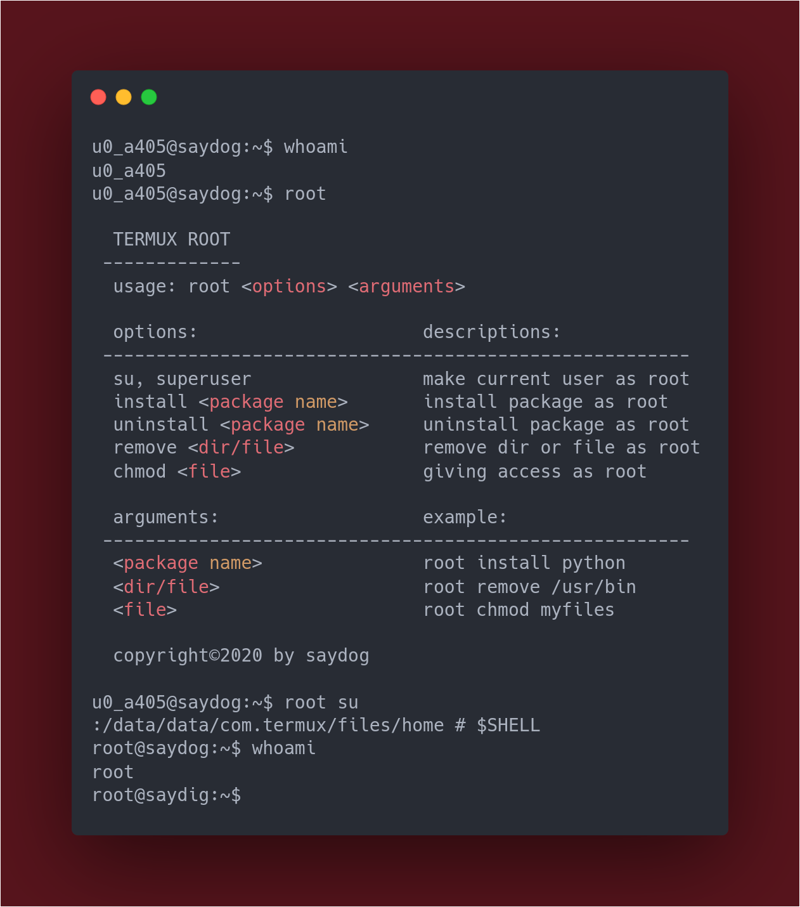

<p align="center">
<H4 align="center">
Emulate chroot, bind mount and binfmt_misc for non-root users
</H4>
<p align="center">sources <a href="https://github.com/termux/proot">termux-proot</a><p>
<a href="https://github.com/saydog"></a>
<a href="https://github.com/saydog"></a>
</br>
<a href="https://github.com/saydog"></a>
<a href="https://youtube.com/saydog-official"></a>
<a href="https://instagram.com/saydog.official"></a>
<p>
Coded by <a href="https://instagram.com/iqbalmh18">Iqbalmh18</a>
</p>

## Installation
Termux :
````
$ git clone https://github.com/saydog/termux-fakeroot
$ cd termux-fakeroot
$ chmod +x setup
$ ./setup
````

## Usage
Commands :

    $ root

## Disclaimer

This is an open source for everyone, you may redistribute, modify, use patents and use privately without any obligation to redistribute. but it should be noted to include the source code of the library that was modified (not the source code of the entire program), include the license, include the original copyright of the author (iqbalmh18), and include any changes made (if modified). Users do not have the right to sue the creator when there is damage to the software or even demand if there is a problem caused by the makers of this tool. because every risk is caused by the user risk it self.
Hatur nuhun 😊

